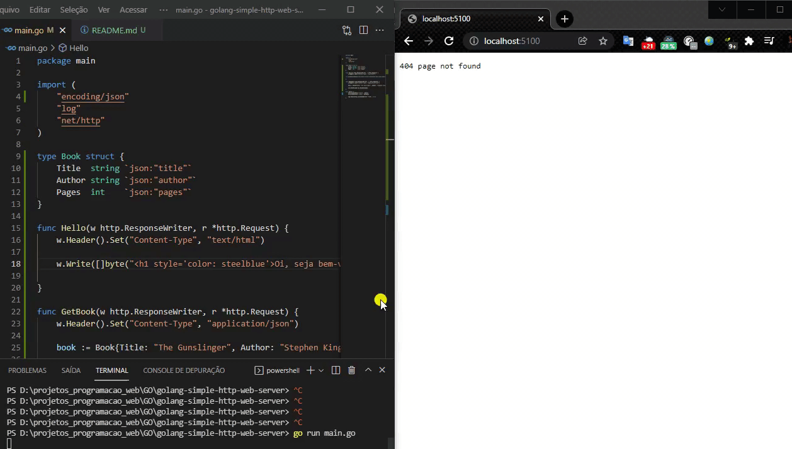

Go é um ambiente de programação de código aberto que faz com que seja fácil de construir software simples, confiável e eficiente.

</img>

Run: go run main.go

Test (Terminal): curl http://localhost:5100/hello

</img>

